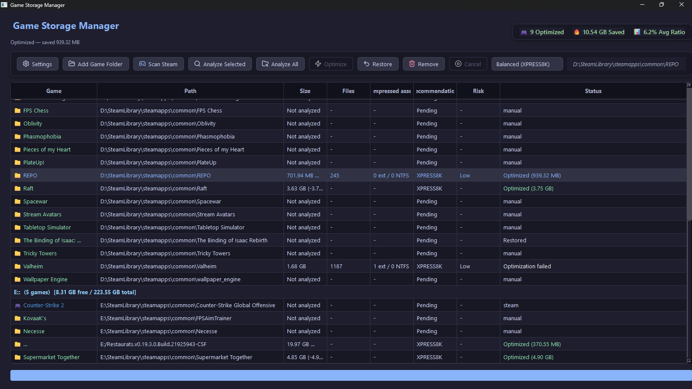

# Game Storage Manager



> Automatically optimize your game library without compromising performance.

**Game Storage Manager** is a Windows desktop tool that reclaims disk space from your installed games using NTFS compression — safe, transparent, and always reversible.

## Migration to Python

This project was migrated from C++ to Python. The original C++ version lives in the `cpp-legacy` branch.

### Key changes

- **Language:** C++17 → Python 3.11+
- **UI:** Qt6 (C++) → PySide6 (Python)
- **Build:** CMake → setuptools + PyInstaller
- **Windows APIs:** Native Win32 → ctypes + winreg + subprocess
- **Compatibility:** 100% compatible with existing `.gsmmeta` and `library.json` files

## How it works

Game Storage Manager uses Windows' `compact.exe` to apply NTFS compression to game folders. Unlike generic tools, it analyzes each game and picks the right algorithm:

| Algorithm | Best for |
|-----------|----------|
| **XPRESS4K** | Light/indie games, fastest decompression |
| **XPRESS8K** | Modern AAA titles (default) |
| **XPRESS16K** | Stronger compression with moderate CPU cost |
| **LZX** | Archived or rarely played games, maximum savings |

The app scans your Steam/Epic libraries, analyzes each game's file structure, detects risky patterns (anti-cheat, DirectStorage, already-compressed assets), and recommends what's safe to optimize.

## Core principles

- **Never break a game.** All compression is reversible with a single click.
- **Never block the UI.** Analysis and compression run on background threads.
- **Smart defaults.** No raw algorithm knobs — only clear, contextual recommendations.
- **Full transparency.** See current size, estimated savings, reason codes, and operation history.

## Architecture

```
game_storage_manager/
  ui/              ← PySide6 views, components, controllers (never calls compact.exe directly)
  core/            ← Game models, analysis, rules engine, safety logic (testable without UI)
  system/          ← Windows interactions, process execution, filesystem adapters
  app/             ← Entry points (CLI and GUI)
  resources/       ← SVG icons, QSS theme
  utils.py         ← Shared utilities
```

Dependency direction: `ui → core → system abstractions`

### Modules

| Module | Responsibility |
|--------|----------------|
| `core/scanner` | Steam library detection, Epic manifests, manual folders |
| `core/analyzer` | Size, file count, extension distribution, compressed asset detection |
| `core/rules_engine` | Recommendation logic, algorithm selection, risk classification |
| `core/compressor` | Compression task coordination, progress tracking |
| `core/safety` | Backup metadata, rollback, access validation |
| `system/process` | Safe `compact.exe` execution, cancellation, error handling |
| `system/filesystem` | Path walking, metadata, validation |

## Installation

### From executable

Download `GameStorageManager.exe` from [Releases](https://github.com/lenase0077/GameStorageManager/releases).

### From source

#### Requirements

- Windows 10/11
- Python >= 3.11
- pip

#### Setup

```powershell
# Clone the repository
git clone https://github.com/lenase0077/GameStorageManager.git
cd GameStorageManager

# Create virtual environment
python -m venv venv
.\venv\Scripts\Activate.ps1

# Install dependencies
pip install -e ".[dev]"
```

#### Run

```powershell
# GUI
python -m game_storage_manager.app.gui.main

# CLI
python -m game_storage_manager.app.cli.main analyze <folder>
python -m game_storage_manager.app.cli.main scan-steam
python -m game_storage_manager.app.cli.main compact-command <compress|restore> <folder> [algorithm]
```

#### Tests

```powershell
pytest tests/ -v
```

#### Linting

```powershell
ruff check game_storage_manager/ tests/
```

#### Build executable

```powershell
pyinstaller --onefile --windowed --name "GameStorageManager" --add-data "game_storage_manager/resources;game_storage_manager/resources" game_storage_manager/app/gui/main.py
```

The executable will be generated at `dist/GameStorageManager.exe`.

## Roadmap

### Phase 1 — MVP ✓
- [x] Manual folder selection, analysis and optimization
- [x] `compact.exe` integration with background execution
- [x] Analyzer, rules engine and compact adapter
- [x] Restoration with `compact.exe /u /s`
- [x] CLI for verification

### Phase 2 — Game Scanner ✓
- [x] Auto-detection of Steam libraries (`libraryfolders.vdf`)
- [ ] Epic Games detection (Planned)
- [x] Space saved metrics per game
- [x] Historical optimization records (persistent JSON metadata)

### Phase 3 — Smart Rules ✓
- [x] Profiles: Fast, Balanced, Strong, Maximum
- [x] Safe cancellation and fallback checks
- [ ] Anti-cheat and DirectStorage risk detection
- [x] Reason codes for every recommendation

### Phase 4 — Polish (Current)
- [x] Minimalist dark UI with Qt (Catppuccin Mocha theme)
- [x] Queue system for batch analysis
- [ ] Pause/resume task queue
- [x] Modern SVG icon integration (Lucide)
- [ ] Installer and release packaging
- [x] Complete migration to Python

## Safety guarantees

- **No file deletion.** Only NTFS compression flags are modified.
- **Full reversibility.** Restores original state with `compact.exe /u /s`.
- **Before and after validation.** Path existence and file access are verified.
- **Risk-aware.** Skips games with heavy anti-cheat, DirectStorage titles, and already-compressed assets by default.
- **Partial failure handling.** If something fails, what succeeded is reported honestly.

## Tech stack

- **Language:** Python 3.11+
- **UI:** PySide6 (Qt6)
- **Compression:** Windows `compact.exe`
- **Packaging:** PyInstaller
- **Testing:** pytest
- **Linting:** ruff
- **Platform:** Windows only

## Contributing

This project follows strict separation rules — see architecture documentation. Commits use conventional commit style (`feat:`, `fix:`, `chore:`, etc.).

## License

To be determined.
